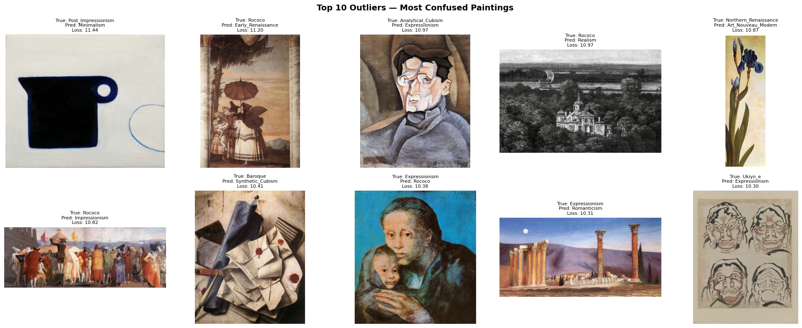

# WikiArt Style Classification — ArtExtract GSoC 2026

## Why This Project

There's something almost mystical about the idea that a painting can hide another reality beneath it — that under the visible brushstrokes of a finished work, there might be a completely different composition, a discarded idea, or an earlier version the artist painted over. The ArtExtract project is ultimately about building systems that can see what humans miss in art. That idea hooked me immediately.

This repository is my implementation for the **HumanAI ArtExtract GSoC 2026 task** — the foundation I'm building toward that larger goal. Before you can find hidden paintings or detect anomalies in art, you need a model that genuinely understands artistic style. That's what this is.

---

## What I Built

A multi-task CRNN (Convolutional-Recurrent Neural Network) trained on 81,444 paintings from the WikiArt dataset, jointly predicting **Style**, **Artist**, and **Genre** from a single shared backbone.

### Why a CRNN and not just a CNN?

Style isn't a local feature. When you look at an Impressionist painting, what tells you it's Impressionist isn't any single patch — it's the way loose brushstrokes repeat and flow across the entire canvas. A plain CNN sees small regions independently and misses that spatial continuity. The BiGRU fixes this by treating the image as a sequence of vertical column features extracted by EfficientNet, capturing left-to-right and right-to-left relationships across the full width of the canvas. That sequential context is exactly what style recognition needs.

### Why EfficientNet?

EfficientNet scales width, depth, and resolution together (compound scaling) instead of just stacking more layers. This gives richer, more expressive feature maps with fewer parameters than ResNet or VGG. For art images where texture and fine detail matter, that efficiency translates directly to better feature extraction without the computational overhead.

---

## Architecture

The model uses a shared EfficientNet-B3 backbone feeding into three specialized heads, each designed around what its task actually needs:

```
EfficientNet-B3 backbone → 1536-channel feature maps
        │
        ├─ Style head:  Reshape → column sequence → 2-layer BiGRU (hidden=256) → FC(512 → 29)
        │               (spatial sequence matters — brushstroke patterns flow across the canvas)
        │
        ├─ Artist head: Global Average Pooling → FC layers → FC(N_artists)
        │               (identity lives in texture and palette, not spatial order)
        │
        └─ Genre head:  Global Average Pooling → FC layers → FC(10)
                        (genre is a holistic signal — GAP captures it cleanly)

Combined loss: λ₁·L_style + λ₂·L_artist + λ₃·L_genre
```

**Training strategy:** Two-phase freeze-unfreeze — backbone frozen in phase 1 to stabilise head convergence, last 3 EfficientNet blocks unfrozen in phase 2 at a lower learning rate. All experiments tracked with [Weights & Biases](https://wandb.ai).

---

## Results

| Task | Accuracy | Weighted F1 |
|------|----------|-------------|
| Style | 78.65% | 0.787 |
| Artist | 83.51% | 0.833 |
| Artist (Top-5) | 96.98% | — |
| Genre | 77.08% | 0.771 |
| **Average** | | **0.797** |

The top-5 artist accuracy of 96.98% is particularly meaningful — given that WikiArt spans 195 artists across wildly different movements, the model almost always places the correct artist in its top 5 predictions.

---

## Outlier Detection

Also implemented an outlier detection pipeline using per-image cross-entropy loss + confidence scoring to identify paintings that don't visually fit their assigned style label.

The logic: high loss + high confidence = genuine outlier. The model is certain it belongs somewhere else. High loss + low confidence = just a hard example.

**Interesting findings:**
- Jackson Pollock drip paintings (labeled Abstract Expressionism) confused the model completely — predicted Baroque at 99% confidence. Makes sense: drip paintings look unlike anything else in the dataset.
- Hilma af Klint (labeled Symbolism) predicted Minimalism — she painted abstract geometric works in 1906, decades before abstraction existed as a movement. The label is arguably wrong.
- Edward Hopper (labeled New Realism) predicted Realism — likely a dataset mislabeling, Hopper is commonly miscategorized in WikiArt.



---

## GSoC 2026 Context

This project is my submission baseline for the **HumanAI Foundation ArtExtract task** under GSoC 2026. The broader ArtExtract vision involves detecting underdrawings and hidden compositions in paintings using multimodal analysis — this multi-task classifier is the perceptual foundation that work builds on. A model that can reliably distinguish Impressionism from Post-Impressionism is doing the same kind of fine-grained texture discrimination that separates nerve from fascia in a surgical image, or tumor from stroma in a histopathology slide. The architecture is more general than it looks.

---

## Notebook

Full implementation: [View Notebook](https://github.com/samanvithkashyap/wikiart-artextract/blob/main/task-1-convolutional-recurrent-architectures.ipynb)

---

## Dataset

WikiArt — 81,444 images, 29 styles, 195 artists, 10 genres.
